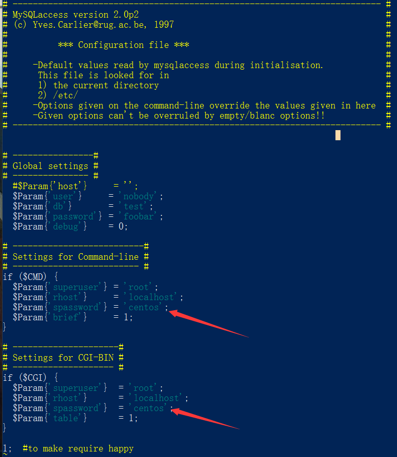

# Portus安装配置(快速搭建版)

[Portus官网](http://port.us.org/)

[Portus文档官网](http://port.us.org/documentation.html)

#### 一句话描述:
一个漂亮页面的docker镜像仓库

##### 说在前面发牢骚的话：
这个东西我在centos7下捅咕了很久，连安装都没搞明白。这东西需要系统ruby2.1版本，但是centos的系统版本如果没记错的话是2.0，我尝试过用ruby自带的升级方式升级，结果安装的时候还是不认，应该是能力不足，ruby没装好。我也学会了少跟系统较劲，可以选择最合适的系统。就像PHP是世界上最好的语言一样。  其实安装方法有很多，这东西也可以跑在docker中，docker仓库里面有几个它的镜像，我跑了一下试试，结果不知道里面root的密码，就放弃了，还是先试试直接安装，以后自行封装docker吧~

###### 环境
opensuse 42.1：mariadb+docker-distribution-registry+ruby2.1

### 安装配置

配置软件源

```
cd  /etc/zypp/repos.d/
wget  http://download.opensuse.org/repositories/Virtualization:/containers/openSUSE_13.2/Virtualization:containers.repo
//文档中有关于rpm的一些说明，里面有你需要的repo
```

```
zypper  install  mariadb
 //安装数据库

zypper in  docker-distribution-registry
 //docker-registry 改名了 不多说
 
zypper in portus
 //安装portus
```

### 配置数据库

mariadb跟mysql差不多，用过的都懂。姐妹版

```
systemctl start  mysql
systemctl status mysql
systemctl enable mysql
//启动服务
```
```
vim  /etc/mysqlaccess.conf
//编辑sql用户access文件
```

个人习惯简单密码centos走起来要不就redhat
```
mysql_secure_installation
//初始化数据库

mysql -uroot -p
//登录sql，创建个库

create database portus;
```

### 配置docker-registry

[docker-registry配置讲解传送门](https://github.com/docker/distribution/blob/master/docs/configuration.md)

本次为急速安装版本，所以先忽略掉配置，直接用portusctl 进行快速配置，跟gogs一样以后再做优化

```
vim  /etc/registry/config.yml
//看下仓库路径在哪里，看着不爽可以自己指定或者详细配置

mkdir  -p  /var/lib/docker-registry
//创建仓库

systemctl list-units  |  grep registry
//查看 registry的服务名字，很不幸就叫registry

systemctl start  registry
systemctl status registry
systemctl enable registry
netstat  -tunlp  |  grep  5000
//启动，查看registry等 .
```

### 配置portus

```
portusctl   help  setup
//查看配置帮助，做一些定制，详细可以观看portus文档

portusctl  setup 
--ssl-gen-self-signed-certs
--db-host=localhost 
--db-username=root 
--db-password=centos
--db-name=portus  
--local-registry

//配置，强烈推荐看官方文档。或者看help
```

```
systemctl list-units  |  grep portus
//查看portus服务叫什么名字

systemctl start   portus_crono.service
systemctl enable portus_crono.service
systemctl status  portus_crono.service
netstat  -tunlp  |  grep  80
netstat  -tunlp  |  grep  443
```
### 登录配置

浏览器打开https://ip
填写信息， 默认创建的第一个用户为管理员
自此安装成功了


